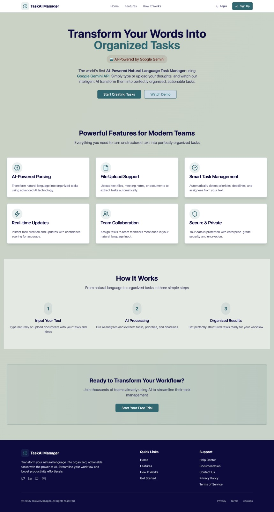

# 🤖 IntelliTask: The Smart Task Manager That Understands You

Ever feel like you're drowning in meeting notes, emails, and chat messages, trying to figure out who needs to do what? IntelliTask is here to change that.

This isn't just another to-do list. It's an intelligent task management application powered by **Google's Gemini AI**. Simply give it your raw, natural language text—like meeting minutes or a project brief—and watch as it automatically identifies, organizes, and assigns actionable tasks.

**Transform your unstructured notes into a perfectly organized workflow, effortlessly.**

---

## ✨ Why You'll Love IntelliTask

We built IntelliTask to solve a real problem: the gap between conversation and action. Here’s how it makes your life easier:

- 🧠 **Let AI Do the Heavy Lifting**: Powered by **Google Gemini**, our app intelligently scans your text to pinpoint tasks, deadlines, and who's responsible. Say goodbye to manual entry.
- 🎯 **From Messy Notes to Clear Tasks**: Paste your meeting minutes or a project plan, and IntelliTask will instantly pull out every actionable item. What was once a wall of text becomes a structured to-do list.
- 🔍 **Smart Context Recognition**: The AI doesn't just find tasks; it understands them. It correctly assigns priorities and deadlines based on the context of your notes.
- ✅ **Full-Featured Task Management**: Beyond the AI magic, it’s a robust task manager. Create, update, and track the status of every task from "To-Do" to "Done."
- 🔒 **Secure and Private**: Your data is protected with secure JWT-based authentication and password hashing, so you can manage your work with peace of mind.

---

## 🛠️ Built With the Best

We chose a modern, powerful tech stack to deliver a seamless and responsive experience.

| Category     | Technology                                        |
| :----------- | :------------------------------------------------ |
| **Frontend** | **React**, Vite, Tailwind CSS, shadcn/ui, Zustand |
| **Backend**  | **Node.js**, Express.js, MongoDB, Mongoose        |
| **AI**       | **Google Gemini Pro**                             |
| **Security** | **JSON Web Tokens (JWT)**                         |

---

## 🚀 Get Started in 5 Minutes

Ready to run IntelliTask locally? Here’s how to get it set up.

### Prerequisites

- **Node.js** (v18 or higher)
- **MongoDB** (you can use a [free Atlas cluster](https://www.mongodb.com/cloud/atlas/register) or run it locally)
- **Google Gemini API Key**

### 1. Clone the Repository

First, grab the code and navigate into the project directory.

> **Note:** For consistency, you may want to rename your GitHub repository to `IntelliTask`.

```bash
# Replace the URL with your repository's new URL
git clone [https://github.com/mehul-raj5/IntelliTask.git](https://github.com/mehul-raj5/IntelliTask.git)
cd IntelliTask

2. Set Up the Backend

# Navigate to the server directory
cd server

# Install dependencies
npm install

# Create a .env file and add your keys
cp .env.example .env

Now, open the .env file and fill in your details:

PORT=5001
MONGO_URI=your_mongodb_connection_string
JWT_SECRET=a_super_strong_secret_key
JWT_EXPIRE=30d
GEMINI_API_KEY=your_google_gemini_api_key

3. Set Up the Frontend
# Navigate to the client directory from the root
cd client

# Install dependencies
npm install

4. Launch the App!
# In your server terminal
npm run dev

# In your client terminal
npm run dev
```

## 📖 Core Functionality

1. **Natural Language Input**: Type or paste text with tasks
2. **AI Processing**: Gemini AI extracts structured tasks
3. **Task Management**: View, edit, update status of tasks
4. **Organization**: Tasks get proper context, priorities, and deadlines

# Home Page



The landing page showcasing the application's AI-powered task management capabilities with a clean, modern interface.

# Sign UP


# Login


# Create Task


Flexible input options - users can either type natural language or upload a text file containing meeting notes or task descriptions.

# DashBoard


Main task dashboard displaying organized tasks extracted by AI, with status indicators, due dates, and assignee information.

## 🌟 What Makes This Special

This isn't just another task manager - it's an **AI-first application** that transforms how teams work using Google's Gemini AI to understand natural language and convert it into actionable tasks.

---

**🤖 Built with MERN stack and Google Gemini AI**
